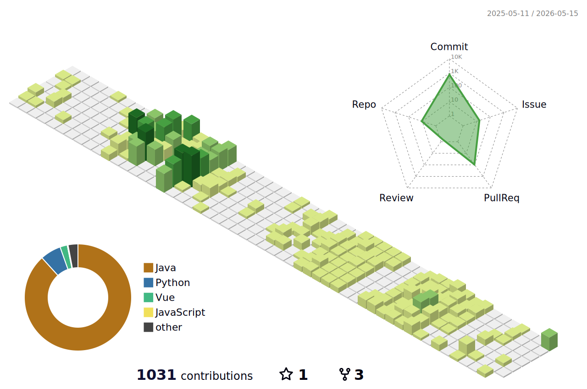

<!-- 헤더 -->

  

<!-- Blog Section -->
<h2 align="center">📚 My Blog</h2>

  

  

<!-- 2x2 그리드 -->
<table align="center">
  <tr>
    <td>
      
    </td>
    <td>
      
    </td>
  </tr>
  <tr>
    <td>
      
    </td>
    <td>
      
    </td>
  </tr>
</table>

